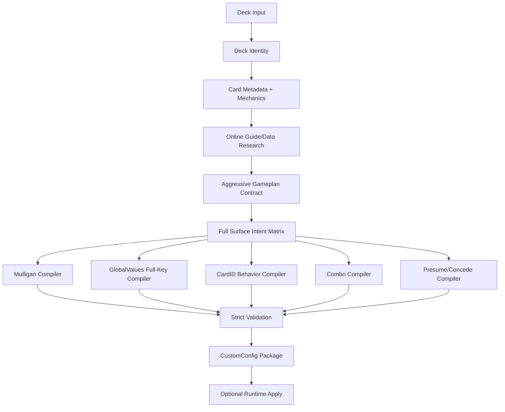

# HSConfig Design Spec

Date: 2026-07-05
Repository target: `Teufelsboy/HSConfig`
Local workspace: repository checkout root

> Historical note: this design spec is superseded for normal operator usage by
> `docs/operator/README.md` and
> `docs/operator/universal-wild-no-block-contract.md`. The current normal path
> is `hsconfig configure`, where `Presume.json` and `Concede.json` are not
> emitted and `SOURCE_BACKED_STRONG` is source confidence, not the runtime-write
> gate.

> **Superseded normal-path warning:** Later references to optional `Presume.json` or `Concede.json` are historical design exploration. The live normal path is `hsconfig configure`, and normal HSConfig output must not emit `Presume.json` or `Concede.json`. Use `docs/operator/README.md`, `.agents/skills/hsconfig/SKILL.md`, and `docs/operator/universal-wild-no-block-contract.md` as the active contract.

## 1. Purpose

HSConfig is a lean Codex skill and supporting Python toolchain for one job:

> Given a Hearthstone deck, create a guide-aligned HearthRanger VisionAI `CustomConfig` package directly.

The user provides a deck name and deck code. HSConfig decodes the deck, researches current online guide and data sources, builds a machine-readable deck gameplan, and writes a complete initial config package:

- `deck_config.ini`
- `GlobalValues.json`
- `Mulligan.json`
- per-card `<CARDID>.json`
- `Combo.json`
- optional `Presume.json`
- optional `Concede.json`

The system assumes the HearthRanger bot plays optimally once the config expresses the right gameplan. HSConfig therefore does not analyze runtime logs, does not inspect replays, does not calculate winrate, and does not perform post-run candidate promotion. Those are HSTuner concerns, not HSConfig concerns.

The config must not be conservative. If current guides and card semantics imply a specific mulligan, target policy, combo sequence, card timing, or board-value posture, HSConfig should express that intent through the strongest documented VisionAI surface available.

The only hard boundaries are:

- exact deck and CardID identity
- documented HearthRanger VisionAI syntax
- strict JSON validity
- full provenance for generated rows
- visible suppression of claims that cannot be safely represented

## 2. Non-Goals

HSConfig must not become another HSTuner.

Out of scope:

- `Power.log` parsing
- HDT replay parsing
- HSReplay XML parsing
- runtime missplay detection
- `algorithm_result_none` / `bot_player_no_result` handling
- decision-row extraction
- candidate promotion
- post-run tuning
- winrate validation
- rollback policy
- autonomous deck replacement after games

Those workflows can consume HSConfig output later, but they must not be embedded in this skill.

## 3. Design Principles

### 3.1 Guide-Aggressive, Syntax-Strict

HSConfig should follow guide expectations aggressively:

- keep cards that guides say are core keeps
- throw cards that guides say are traps
- prefer face, trade, own-minion, or enemy-minion targets when the deckplan says so
- create combo rows when sequencing is concrete
- encode Discover and choice priorities when the guide or card role implies them
- adjust deck-wide board-value posture instead of leaving `GlobalValues.json` generic

But HSConfig must not produce invalid runtime files. If a guide claim cannot be represented through documented VisionAI syntax, keep it visible in a suppression report instead of emitting guessed JSON.

### 3.2 Every Card Must Be Accounted For

Every decoded card must receive at least one of:

- an emitted runtime rule
- an explicit gameplan role
- a confirmed baseline/no-change decision
- a report-only note
- a contract gap

No card may disappear silently.

### 3.3 GlobalValues Is A Full Surface

`GlobalValues.json` is not a tiny override file. HearthRanger recommends copying the default `GlobalValues.json` and editing it. HSConfig must therefore:

- load the full default baseline
- profile every key
- classify every key
- decide whether to change, keep, or block every key
- emit a complete `GlobalValues.json`
- explain unchanged keys

The final design must not treat only `FirstTurnValueWeight` and `SecondTurnValueWeight` as meaningful. Those are important, but every copied key must pass through a deckplan-aware authority matrix.

### 3.4 Small Skill, Hard Toolchain

The Codex skill should stay short. Heavy logic belongs in deterministic Python modules and reference files:

- `SKILL.md`: when to use the skill and the high-level workflow
- references: VisionAI surface rules, guide policy, output contracts
- scripts / package modules: deck decode, research normalization, compilation, validation

## 4. Workflow



## 5. Inputs

Required:

```json
{
  "deck_name": "ShadowPriest",
  "deck_code": "AAEBA...",
  "runtime_root": "<HearthRangerRoot>"
}
```

Optional:

```json
{
  "format": "wild",
  "target_config_mode": "preview",
  "source_policy": "current_guides_and_data",
  "allow_runtime_apply": false
}
```

Defaults:

- `target_config_mode`: `preview`
- `allow_runtime_apply`: `false`
- `format`: derived from deckstring or marked unknown
- output path: `outputs/<deck_slug>`

## 6. Output Package

A successful build creates:

```text
outputs/<deck_slug>/
├─ contracts/
│  ├─ input_manifest.json
│  ├─ deckstring_decode_receipt.json
│  ├─ card_id_map.json
│  ├─ card_metadata_snapshot.json
│  ├─ source_evidence_index.json
│  ├─ patch_context_receipt.json
│  ├─ archetype_research.json
│  ├─ gameplan_contract.json
│  ├─ card_role_map.json
│  ├─ card_usage_expectations.json
│  ├─ config_surface_intent_map.json
│  ├─ global_values_overlay_plan.json
│  ├─ global_values_key_authority.json
│  └─ config_row_provenance.json
├─ CustomConfig/
│  ├─ deck_config.ini
│  └─ <deck_slug>/
│     ├─ GlobalValues.json
│     ├─ Mulligan.json
│     ├─ Combo.json
│     ├─ <CARDID>.json
│     ├─ Presume.json
│     └─ Concede.json
└─ reports/
   ├─ validation_report.json
   ├─ package_manifest.json
   ├─ global_values_key_profile_report.json
   ├─ card_coverage_report.json
   ├─ suppressed_rules_report.json
   └─ source_summary.md
```

`Presume.json` and `Concede.json` are optional emitted files. If no safe first-class rule exists, HSConfig must still create report entries explaining the decision.

## 7. Public CLI

The CLI should stay small:

```powershell
hsconfig build --deck-name "DeckName" --deck-code "..." --runtime-root "<HearthRangerRoot>" --out ".\outputs\deckname" --json
hsconfig validate --package ".\outputs\deckname" --json
hsconfig apply --package ".\outputs\deckname" --runtime-root "<HearthRangerRoot>" --json
```

`build` performs deck identity, research, contracts, compilers, and validation.

`validate` reruns package validation without rebuilding research.

`apply` writes the package to HearthRanger runtime only after validation passes. Apply must be separate from build, even if the skill can call it automatically in a later workflow.

## 8. Repository Layout

```text
<repository-root>
├─ AGENTS.md
├─ README.md
├─ pyproject.toml
├─ src/
│  └─ hsconfig/
│     ├─ cli.py
│     ├─ deck_identity.py
│     ├─ card_metadata.py
│     ├─ guide_research.py
│     ├─ gameplan_contract.py
│     ├─ surface_intent.py
│     ├─ compile_mulligan.py
│     ├─ compile_globalvalues.py
│     ├─ compile_cardid.py
│     ├─ compile_combo.py
│     ├─ compile_optional_surfaces.py
│     ├─ validate_package.py
│     └─ runtime_apply.py
├─ .agents/
│  └─ skills/
│     └─ hsconfig/
│        ├─ SKILL.md
│        ├─ references/
│        │  ├─ workflow.md
│        │  ├─ visionai-surfaces.md
│        │  ├─ guide-research-policy.md
│        │  ├─ globalvalues-policy.md
│        │  ├─ card-behavior-policy.md
│        │  └─ output-contract.md
│        └─ scripts/
│           ├─ build_config.py
│           └─ validate_package.py
├─ docs/
│  ├─ design/
│  ├─ research/
│  └─ superpowers/
│     └─ specs/
├─ tests/
│  └─ fixtures/
└─ outputs/
```

## 9. Module Responsibilities

### 9.1 `deck_identity.py`

Decode the deckstring and create stable identity receipts.

Responsibilities:

- decode deck code
- preserve hero DBF IDs
- preserve duplicate counts
- preserve sideboards if present
- map DBF IDs to CardIDs
- derive deck fingerprint
- fail visibly on unresolved required IDs

Outputs:

- `deckstring_decode_receipt.json`
- `deck_card_multiset.json`
- `card_id_map.json`
- `hero_identity.json`

### 9.2 `card_metadata.py`

Hydrate every card with card text and mechanical data.

Data sources:

- HearthstoneJSON
- HearthSim / HSData CardDefs where needed
- local HearthRanger card data if available

Responsibilities:

- map CardID, DBF ID, name, cost, type, class
- capture mechanics and referenced tags
- capture target and play requirements where available
- resolve hero powers, generated entities, rewards, related cards
- assign mechanic families

Outputs:

- `card_metadata_snapshot.json`
- `mechanic_taxonomy.json`
- `generated_entity_map.json`
- `targeting_requirements.json`

### 9.3 `guide_research.py`

Collect and normalize guide/data claims.

Supported source families:

- current deck guides
- Vicious Syndicate
- HSReplay where accessible
- HSGuru
- official patch notes
- other deck-specific guide pages when source quality is acceptable

Responsibilities:

- record source URLs and retrieval date
- record patch context
- extract archetype, mulligan, role, combo, target, posture, and bad-pattern claims
- attach confidence and freshness
- avoid copying large guide text

Outputs:

- `source_evidence_index.json`
- `patch_context_receipt.json`
- `archetype_research.json`
- `mulligan_anchor_map.json`
- `card_role_map.json`
- `card_usage_expectations.json`
- `known_bad_patterns.json`
- `matchup_posture_assumptions.json`

### 9.4 `gameplan_contract.py`

Build the central semantic contract.

Hard rule: every card must be accounted for.

`gameplan_contract.json` must include:

- archetype
- deck speed
- win condition
- pressure turns
- mulligan plan
- per-card roles
- per-card usage expectations
- target policy
- face-vs-trade policy
- resource policy
- hero power policy
- combo sequencing
- board-value intent
- known bad patterns
- unknowns and contract gaps

### 9.5 `surface_intent.py`

Route every gameplan claim to a config surface.

Possible surfaces:

- `Mulligan.json`
- `GlobalValues.json`
- `<CARDID>.json`
- `Combo.json`
- `Presume.json`
- `Concede.json`
- report-only suppression

Output:

- `config_surface_intent_map.json`
- `config_row_plan.json`
- `suppressed_rules_report.json`

## 10. Compiler Designs

### 10.1 Mulligan Compiler

Official surface: `Mulligan.json`.

The compiler should emit:

- guide-backed keeps
- guide-backed throws
- `DROP1`, `DROP2`, `DROP3`, etc.
- plus-combo keeps
- coin / no-coin conditions
- opponent class conditions
- discard fallback when the guide defines a narrow keep plan

Rules:

- preserve row order
- use `hold` and `discard`
- hold rules outrank discard rules
- suppress only when no documented condition can represent the guide claim

### 10.2 GlobalValues Full-Key Compiler

Official surface: `GlobalValues.json`.

This compiler is mandatory for every deck.

Required process:

1. Load default `GlobalValues.json` from the HearthRanger runtime or bundled fixture.
2. Copy all keys into the deck config.
3. Classify every key.
4. Apply archetype-specific overlay rules.
5. Leave unchanged keys only with explicit reasons.
6. Emit full `GlobalValues.json`.
7. Emit full key profile report.

Each key receives:

```json
{
  "key": "GlobalDivineShield",
  "category": "mechanic_modifier",
  "baseline_value": "2.74",
  "decision": "overlay_changed_or_baseline_confirmed_or_blocked_unknown_semantics",
  "new_value": "3.15",
  "reason": "Guide expects sticky board pressure; divine shield minions are central to the deckplan.",
  "source_refs": ["source_evidence_index:..."],
  "risk": "medium"
}
```

The compiler must not only adjust `FirstTurnValueWeight` and `SecondTurnValueWeight`. It must consider all keys and explain the final state of all keys.

### 10.3 CardID Behavior Compiler

Official surface: `<CARDID>.json`.

The compiler should use the most specific documented block:

- `InHandBonus`
- `OnBoardBonus`
- `BeforePlayCardBonus`
- `BeforeBattlecryTargetBonus`
- `BeforeUseHeroPowerBonus`
- `BeforePhysicalAttackBonus`
- `BeforeEndTurnBonus`
- `OnDiscoverCardBonus`
- `OnChooseOneCardBonus`
- `OnAdaptCardBonus`
- `BeforeUpgradeCardBonus`
- `InHandPlayPriority`
- `OnBoardPlayPriority`

Rules:

- file name must be `<CARDID>.json`
- `GameCardId` must equal the CardID
- value fields are strings
- row order must preserve priority
- every row must have provenance
- every guide claim with documented syntax should emit a row
- unsupported claims must be visible in suppression reports

### 10.4 Combo Compiler

Official surface: `Combo.json`.

Emit concrete sequences:

- same-turn sequence: `CARD_A >> CARD_B`
- cross-turn sequence: `CARD_A >-> CARD_B`

Rules:

- require at least two concrete CardIDs
- sequence order must be explicit
- number of combo segments must match number of value segments
- vague synergy language remains report-only

### 10.5 Optional Presume / Concede Compiler

Official surfaces:

- `Presume.json`
- `Concede.json`

`Presume.json` should be emitted when:

- opponent card IDs are concrete
- matchup or class condition is explicit
- copy limit is clear
- the guide or gameplan says to play around that risk

`Concede.json` should be emitted only when:

- the condition is deterministic
- the policy is explicitly enabled
- the value is literal and documented

Default posture:

- `Presume.json`: allowed but gated
- `Concede.json`: disabled unless explicitly enabled

## 11. Validation

Validation must run after every build.

Checks:

- all JSON parses
- no comments
- no trailing commas
- required top-level keys exist
- `GameCardId` matches file role
- CardID file names match `GameCardId`
- only documented VisionAI blocks are emitted
- all rows use `values` arrays where required
- `Mulligan.json` values are `hold` or `discard`
- `Combo.json` segment parity is valid
- `GlobalValues.json` contains all baseline keys
- every GlobalValues key has a profile decision
- every deck card has coverage
- every emitted row has provenance
- suppressed guide claims are reported
- package manifest hashes all generated files

Validation output:

- `validation_report.json`
- `package_manifest.json`
- `config_row_provenance.json`

## 12. Runtime Apply Boundary

`build` creates a preview package.

`apply` is separate and writes to:

```text
<runtime_root>\CustomConfig\deck_config.ini
<runtime_root>\CustomConfig\<deck_slug>\*.json
```

Apply requirements:

- package validation passed
- runtime root exists
- `CustomConfig` exists or can be created
- `deck_config.ini` is updated with exact deck name mapping
- no unrelated deck config is removed
- write receipt is created

Output:

- `write_receipt.json`

## 13. Skill Design

The repo-local skill path should be:

```text
<repository-root>\.agents\skills\hsconfig
```

`SKILL.md` must stay short:

- when to use
- required inputs
- workflow command sequence
- output expectations
- boundaries

Large details must move to references:

- `workflow.md`
- `visionai-surfaces.md`
- `guide-research-policy.md`
- `globalvalues-policy.md`
- `card-behavior-policy.md`
- `output-contract.md`

Scripts:

- `scripts/build_config.py`
- `scripts/validate_package.py`

The skill should trigger for:

- “create HearthRanger config for this deck”
- “build VisionAI config”
- “make Mulligan/GlobalValues/CardID/Combo for deck”
- “generate CustomConfig from deck code”

It should not trigger for:

- post-game log analysis
- replay parsing
- winrate analysis
- HSTuner patch loops

## 14. Testing Strategy

Unit tests:

- deckstring decode
- CardID mapping
- metadata hydration
- guide claim normalization
- gameplan contract completeness
- Mulligan compiler
- GlobalValues full-key compiler
- CardID compiler
- Combo compiler
- optional surface gating
- validation failure cases

Fixture tests:

- one aggro deck
- one combo deck
- one control deck
- one deck with Discover/choice behavior
- one deck with no safe optional Presume/Concede output

Negative tests:

- unknown DBF ID
- missing default GlobalValues baseline
- invalid Combo segment count
- CardID filename mismatch
- unsupported VisionAI block
- unaccounted deck card
- guide claim with no runtime surface

## 15. Acceptance Criteria

The design is implemented when:

1. `hsconfig build` accepts a deck name and deck code.
2. The deck code resolves to exact CardIDs.
3. Every deck card appears in `gameplan_contract.json`.
4. Every deck card appears in card coverage output.
5. `GlobalValues.json` is complete and based on a full baseline.
6. Every GlobalValues key has a profile decision.
7. `Mulligan.json` reflects guide keeps and throws.
8. `<CARDID>.json` files are generated for cards with behavioral intent.
9. `Combo.json` is generated for concrete sequences.
10. `Presume.json` / `Concede.json` are generated only when first-class conditions are met.
11. All runtime files validate as strict JSON.
12. Every emitted row has provenance.
13. Suppressed guide claims are visible.
14. `hsconfig validate` passes on a generated package.
15. `hsconfig apply` can write the package to a runtime root with a write receipt.

## 16. Open Implementation Choices

These should be resolved in the implementation plan:

- whether `hsconfig build` should always browse live sources or support a cached/offline mode
- exact dependency choice for deckstring decoding
- whether HearthstoneJSON data is downloaded per run or cached by build/version
- how to locate the default `GlobalValues.json` when HearthRanger is unavailable
- whether `Presume.json` is enabled in MVP or delivered as report-only first
- how many fixture decks are required before first use

## 17. Research Basis

This spec is grounded in the local research packages:

- `docs/research/2026-07-05-hsconfig-step-architecture`
- `docs/research/2026-07-05-hsconfig-nonconservative-design-audit`

Both research packages validated with complete field coverage after schema normalization.

Important external source families:

- HearthRanger VisionAI docs for `GlobalValues.json`, `Mulligan.json`, `CARDID.json`, `Combo.json`, `Presume.json`, and `Concede.json`
- HearthSim Deckstrings
- HearthstoneJSON
- HearthSim / HSData card data
- HSReplay mulligan data where accessible
- HSGuru statistics and deck pages
- Vicious Syndicate reports and deck guides
- official Blizzard patch notes

## 18. Final Design Position

HSConfig should be a direct, aggressive, guide-aligned config authoring skill.

It should generate a fully reasoned initial config, not a cautious starter package. The system must use all relevant HearthRanger config surfaces and must fully profile `GlobalValues.json`. It remains safe by validating syntax, preserving provenance, and reporting unsupported claims, not by avoiding strong config decisions.
